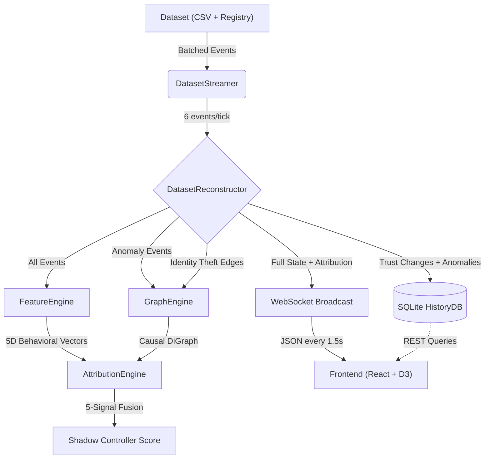

# System Architecture

AEGIS is an event-driven monolith built for deterministic analysis of network telemetry. Raw events flow through a multi-layer verification pipeline, get scored for trust, feed into a causal graph for attribution, get persisted to SQLite, and stream to the dashboard — all within a single 1.5-second tick cycle.

The system is organized into five distinct phases: **Ingestion**, **Reconstruction**, **Attribution**, **Persistent Storage**, and **Real-Time Visualization**.

## Architecture Diagram

### 1. Ingestion Layer — `simulation/dataset_streamer.py`
The `DatasetStreamer` reads telemetry from static CSV files and outputs controlled batches to simulate live network traffic.
- **Data Joining:** Merges `system_logs.csv`, `node_registry.csv`, and `schema_config.csv` at runtime to construct complete event objects.
- **Identity Decoding:** Extracts Base64-encoded hardware identities from raw user-agent strings during ingestion.
- **Batching:** Outputs 6 events per tick (every 1.5 seconds), maintaining chronological order to simulate realistic traffic patterns.

### 2. Reconstruction Layer — `engine/dataset_reconstructor.py` + `engine/patient_zero.py`
The forensic core of AEGIS. The Reconstructor maintains a `NodeState` object in memory for every node it has ever seen, tracking trust scores, EWMA latency baselines, identity ownership, and anomaly history.

Each incoming event passes through four verification layers in strict priority order:
- **Layer 0 — Ghost Node Trap:** Node IDs ≥ 500 are flagged as unauthorized entities.
- **Layer 1 — Identity Verification:** Decoded Base64 identities are checked against the ownership ledger. Mismatches trigger IDENTITY_THEFT with a -100 penalty and a causal edge in the GraphEngine.
- **Layer 2 — Schema Evasion:** Unexpected schema version mutations are flagged as SCHEMA_ROTATION.
- **Layer 3 — Latency/DDoS Detection:** Response times exceeding 3σ of the EWMA baseline are flagged. High system load (>85%) upgrades the classification to DDOS_ATTACK.

The `PatientZeroTracker` runs alongside the Reconstructor, clustering anomalies within a 60-second window to identify the earliest origin node with a smoothed confidence score.

### 3. Attribution Layer — `engine/attribution_engine.py`, `engine/graph_engine.py`, `engine/feature_engine.py`
This is where AEGIS identifies the **Shadow Controller** — the most causally influential malicious node.

| Signal | Weight | Source | Purpose |
| :--- | :--- | :--- | :--- |
| **Propagation** | 30% | Sum of outgoing edge weights in GraphEngine | Measures how much downstream anomaly activity this node *causes* |
| **Betweenness Centrality** | 30% | NetworkX on the causal DiGraph | Identifies nodes that act as structural bridges for lateral movement |
| **PageRank** | 10% | NetworkX with weighted edges | Measures downstream orchestration dominance via link analysis |
| **ML Anomaly** | 10% | IsolationForest on FeatureEngine vectors | Detects rigid, bot-like communication patterns indicative of C2 scripts |
| **Frequency** | 5% | Normalized degree weight from GraphEngine | Measures gross edge activity volume |

**Note:** Closeness Centrality is computed for diagnostic visibility in the breakdown panel but is deliberately excluded from the final score formula. Proximity to other nodes does not reliably indicate control — a design decision validated through extensive testing.

- **GraphEngine:** Maintains a deque of the last 200 anomaly events. Each tick, it rebuilds a directed `nx.DiGraph` from temporal proximity (log_id gaps of 1-3) and verified identity theft edges (weight 1.2). No stale edges persist between ticks.
- **FeatureEngine:** Computes a 5-dimensional behavioral vector per node from a rolling window of 50 events: average latency, average load, HTTP error rate, inter-arrival variance, and transition entropy.
- **Stability Boost:** PageRank variance over a 20-tick window is tracked. Low variance (persistent influence) applies a multiplicative boost, rewarding sustained orchestration over transient anomaly spikes.
- **Dominance Boost:** Nodes scoring ≥0.7 in *both* Propagation and Betweenness receive a +0.05 deterministic tie-breaker, ensuring the most structurally dominant node isn't lost to rounding.

### 4. Persistent Storage — `database/history_db.py`
An embedded SQLite database logs every trust-impacting event.
- **High-Speed Writes:** Uses `check_same_thread=False` and `isolation_level=None` for non-blocking writes from the async simulation loop.
- **Debouncing:** Prevents duplicate logging by capping identical anomalies to one event per 2.0-second window per node-type pair.
- **Auto-Pruning:** Self-healing queries cap the database at 10,000 rows to prevent unbounded disk growth.

### 5. Real-Time Transport — `main.py` + Frontend
FastAPI serves as both the web server and the simulation orchestrator.
- **Async Simulation Loop:** An `asyncio` task fires every 1.5 seconds, pulling a batch from the streamer, processing it through the Reconstructor and AttributionEngine, and broadcasting the full state to all WebSocket clients.
- **REST API:** Stateless endpoints fetch historical data from SQLite for deep-dive investigations, bridging the live WebSocket stream with persistent logs.
- **Frontend:** A monolithic React application embedded in `index.html`, using D3.js for force-directed graph layouts and HTML5 Canvas for high-performance radar map rendering. Six dashboard views provide different analytical perspectives.

## Technology Stack

| Component | Technology | Why |
| :--- | :--- | :--- |
| Backend | Python 3.10, FastAPI | Native async concurrency via `asyncio` |
| Attribution | NetworkX, scikit-learn, NumPy | Graph algorithms and unsupervised anomaly detection |
| Transport | WebSockets | Persistent connections for true real-time streaming |
| Database | SQLite3 | Embedded, zero-config, portable |
| Frontend | React 18 | State-driven re-rendering from WebSocket payloads |
| Visualization | D3.js, Chart.js, HTML5 Canvas | High-framerate rendering of force graphs and radar maps |
| Styling | Tailwind CSS | Utility-first design for precise layouts |
